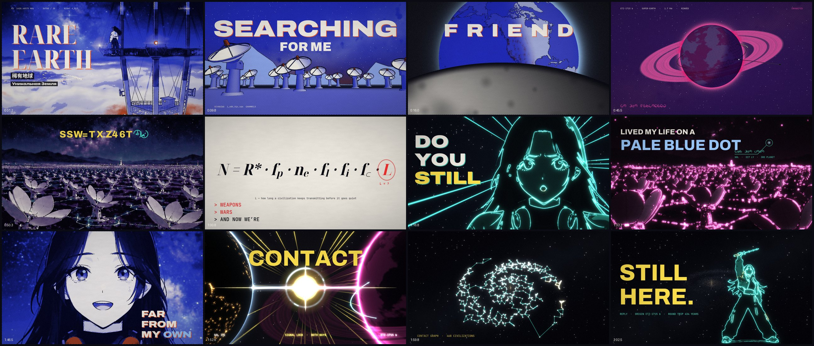

# RARE EARTH — music video, DDR steps, and Beat Saber

A music video for **"Rare Earth"** (DDR / techno version), a song about hoping to find intelligent
life, written by Jade Q Wang and Charlie van Norman (Robot Ninja Apocalypse) for the SETI crowdfunding
campaign in 2011.

## DDR review for Kenton

The **Model Edition** has eight new charts: four singles generated with ITGPT's
trained models and four doubles generated with GrooveAuthor's footwork library.
Physical pad testing and an in-game load check are pending.

- **[Download the Model Edition step pack (ZIP)](https://github.com/jadeqwang/rare-earth-techno-remix/raw/refs/heads/codex/ddr-model-edition-review/ddr/experiments/2026-10-05/release/Rare_Earth_Model_Edition_Step_Pack.zip)**
- **Watch:** [Model singles preview](https://github.com/jadeqwang/rare-earth-techno-remix/raw/refs/heads/codex/ddr-model-edition-review/ddr/experiments/2026-10-05/release/preview/Rare_Earth_Model_Edition_single_preview.mp4)
  · [Model doubles preview](https://github.com/jadeqwang/rare-earth-techno-remix/raw/refs/heads/codex/ddr-model-edition-review/ddr/experiments/2026-10-05/release/preview/Rare_Earth_Model_Edition_double_preview.mp4)
- **[Install and give pad-test feedback](ddr/experiments/2026-10-05/PAD_REVIEW.md)**
  · [Generation comparison and validation](ddr/experiments/2026-10-05/README.md)
- **[Download the music video](https://github.com/jadeqwang/rare-earth-techno-remix/raw/refs/heads/main/out/rare_earth_1080p.mp4)**
  · [Use it as the StepMania background](#use-the-music-video-as-the-stepmania-background)

Extract the Model Edition ZIP into StepMania's `Songs` folder and select
**Rare Earth Model Pack**. The original **Rare Earth Pack** below remains available
for comparison. The [pad review guide](ddr/experiments/2026-10-05/PAD_REVIEW.md)
includes the provisional meters and passages to check.

## Play Rare Earth in StepMania

**[Download the DDR step pack (ZIP)](https://github.com/jadeqwang/rare-earth-techno-remix/raw/refs/heads/main/ddr/Rare_Earth_DDR_Step_Pack.zip)**

Eight charts for **StepMania 3.9 and StepMania 5**: Beginner, Easy, Standard,
and Heavy for both four-panel single and eight-panel double. The ZIP includes
the song, `.sm` and `.ssc` files, and artwork.

| Difficulty | Single meter | Double meter |
|---|---:|---:|
| Beginner | 3 | 3 |
| Easy | 4 | 5 |
| Standard | 6 | 7 |
| Heavy | 9 | 10 |

**Watch the steps:** [Single preview](https://github.com/jadeqwang/rare-earth-techno-remix/raw/refs/heads/main/ddr/preview/Rare_Earth_DDR_single_preview.mp4)
· [Double preview](https://github.com/jadeqwang/rare-earth-techno-remix/raw/refs/heads/main/ddr/preview/Rare_Earth_DDR_double_preview.mp4).
Each 60 fps preview shows all four levels. Tap arrows disappear when they reach the
press point; holds remain until release.

To install, extract the ZIP into StepMania's `Songs` folder, then reload songs
or restart the game. Look for **Rare Earth Pack**. To update an existing copy,
replace its song folder and reload the song cache.

Meters use the classic DDR scale and remain provisional until pad playtesting.
See the [installation details, chart descriptions, and validation](ddr/README.md).

### Use the music video as the StepMania background

These instructions apply to either DDR edition in **StepMania 5**. The video is
an optional separate download (about 92 MB).

1. [Download `rare_earth_1080p.mp4`](https://github.com/jadeqwang/rare-earth-techno-remix/raw/refs/heads/main/out/rare_earth_1080p.mp4)
   and copy it into the installed song folder, beside the MP3 and chart files:
   `Songs/Rare Earth Model Pack/Rare Earth (Techno Remix - Model Edition)/`
   for the Model Edition, or
   `Songs/Rare Earth Pack/Rare Earth (Techno Remix)/` for the original.
2. Open the song's `.ssc` and `.sm` files in a plain-text editor. Add this block
   to the shared header, before the first `#NOTEDATA:` or `#NOTES:` tag. If there
   is already a `#BGCHANGES:` block, replace it rather than adding a second one.

   ```text
   #BGCHANGES:
   -0.131511=rare_earth_1080p.mp4=1.000=0=0=0,
   99999=-nosongbg-=1.000=0=0=0;
   ```

3. Keep `#MUSIC:Rare_Earth_DDR.mp3;` and `#BACKGROUND:background.jpg;` unchanged.
   The MP3 supplies gameplay audio; the picture remains the selection background.
4. Save both files, reload songs or restart StepMania, and enable song backgrounds.
   Turn off **Static Background** and **Random Background Only**, if your theme
   exposes those options, and set background brightness above zero.

The negative start beat is calculated from this pack's `-0.0611` offset and
initial `129.143349118` BPM to align video time zero with MP3 time zero. The
engine's beat rounding can leave a few milliseconds of difference. Keep
the video playback rate at `1.000` through the tempo changes. This timing line
follows StepMania's [BGCHANGES format](https://github.com/stepmania/stepmania/wiki/sm#bgchanges)
and [background timing implementation](https://github.com/stepmania/stepmania/blob/5_1-new/src/Background.cpp);
video playback and sync still need an in-game check on Kenton's machine.

If the video stays black or fails to load, check the filename and background
options first. A build that cannot decode this MP4 may need a converted video.
For StepMania 3.9, use a video format supported by that installation and change
the filename in the block accordingly; these MP4 instructions target StepMania 5.

## Play Rare Earth in Beat Saber

**[Download the Beat Saber map pack (ZIP)](https://github.com/jadeqwang/rare-earth-techno-remix/raw/refs/heads/main/beatsaber/Rare_Earth_Beat_Saber_Pack.zip)**

Three Standard, two-saber charts using **the same 2:08 track as the DDR pack**,
with alternating swings, accents at the drops, and synchronized lighting.
The original recording is converted to Ogg Vorbis for Beat Saber without
trimming or changing its tempo. All charts follow its gradual acceleration
from 129 to 136 BPM.

| Difficulty | Blocks | Average notes/sec |
|---|---:|---:|
| Normal | 228 | 1.78 |
| Hard | 357 | 2.79 |
| Expert | 497 | 3.88 |

**[Watch the full-length Beat Saber preview](https://github.com/jadeqwang/rare-earth-techno-remix/raw/refs/heads/main/beatsaber/preview/Rare_Earth_Beat_Saber_preview.mp4)** — all three charts side by side, with the packaged audio.
This is an autoplay visualization of the exported maps.

For PC VR, extract the ZIP into a song folder inside
`Beat Saber_Data/CustomLevels/`. Standalone Quest requires an existing
custom-song setup. See the [installation instructions and validation](beatsaber/README.md).
Timing, audio alignment, and swing-direction checks passed; the maps remain
a first draft pending an in-game load test and VR playtest.

## Music video

**▶ [`out/rare_earth_1080p.mp4`](out/rare_earth_1080p.mp4)** (1920×1080, 24 fps, 2:09). DOT has the
v3 hairstyle: centre part, long curtain bangs, long layers. This cut also renames the other world
**Echo**, ends on its beacon rather than an impossible reply, and gives every shot of Echo its own
footage (`docs/PROCESS.md` §3c). The release pass (§3d) sets the character sheet's lettering on DOT's
jacket (RARE EARTH) and sleeve patch (1420 MHz), re-times her mouth to the vocal in the eight shots
where it drifted, shows a nuclear exchange on *or self-destruct* with that whole line kept on screen,
and credits the songwriters on the end card. The first cut, with a hime cut, is in the git history at
commit `8dedea7`.



Every frame you see is drawn by JavaScript: WebGL shaders and canvas type, rendered frame by frame
in headless Chromium. AI video generation (Seedance 2.5) was used only as rotoscope reference for
DOT's performances and the other world's plates. The generated footage itself never appears. The
renderer reads it as guide maps (edges, tone, matte, colour class) and redraws it as riso-print ink,
halftone and neon light.

## The idea

Two lonely worlds, each singing into the dark, find out the other one was listening the whole
time, and the song itself is the signal. Verses 1–2 are Earth asking. The build reveals
**Echo**, a fictional world 217 light-years away in the Earth Transit Zone, the part of the sky from
which *our* planet can be seen crossing the Sun. Verse 3 is the Great Filter: the launch that could
carry us to the stars *or* a nuclear exchange over the pole, the Drake equation's **L**, weapons, wars,
the blank, and *keep up funding*. Verses 4–5 repeat as call-and-response between
the two worlds. The final drop is contact: the galaxy lights up with a web of civilizations, and
Echo's beacon, sent in 1809, decodes as **STILL HERE.**

Echo is too far away to have heard us: our radio has only travelled about 100 light-years. It could
have seen Earth transit the Sun, so the message is their beacon, not a reply. The transmission Earth
sends in the video (2026) reaches Echo in 2243.

Earth gets at least as much screen time as the other world. The other world is only ever seen
zoomed out, as cities by day and night, a listening field, a lone dish on a cliff, a sea under two
moons, a signal tower and its beam, a space elevator, and its night side from orbit, never its people.
No plate of it plays twice. The full treatment is in [`docs/TREATMENT.md`](docs/TREATMENT.md) and
[`docs/PROCESS.md`](docs/PROCESS.md).

## How it was made

| Stage | Where | What |
|---|---|---|
| Song analysis | `pipeline/lyrics_align.py`, `pipeline/audio_map.py` | vocal stem (MDX-Net Kim_Vocal_2) → Whisper large-v3-turbo → word timings aligned to the canonical lyrics and snapped to vocal onsets; beat grid (the tempo accelerates 129.7 → 135 BPM), kick/snare onsets, per-frame features → `render/data/audio.json` |
| Design | `design/`, `pipeline/prompts/` | style board (SIGNAL PRINT), DOT character sheets, Earth and Echo world sheets (GPT Image 2.5, Nano Banana Pro, Seedream 5 Pro, FLUX.2 max, Grok Imagine); their labels were fact-checked and corrected in pass 3 (`pipeline/sheet_fixes/`) |
| Base performances | `pipeline/seedance_shots.py`, `pipeline/run_seedance.py` | 23 shots × multiple takes on Seedance 2.5 (720p), each passed the cut song audio as a lip-sync reference and the character sheet as an image reference |
| Lip-sync verification | `pipeline/sync/` | anime face / mouth tracking → mouth-openness curve, cross-correlated with the vocal envelope over exactly the window each shot uses; per-take lag measured and corrected (`clipTime = t − start + lag`); visual word strips for manual checks. Where one lag can't fit a take, the mouth is re-timed on its own: each drawing gets the mouth from the same take that matches the vocal stem, registered onto the face (`remouth.py`) |
| Plate fixes | `pipeline/plate_fixes/` | the lettering the takes invented ("PACE EARTH", "D20 IHz") is painted out and the sheet's RARE EARTH and 1420 MHz set in its place, tracked through every frame (the patch's ring fitted as an ellipse) |
| Rotoscope guides | `pipeline/roto_extract.py`, `pipeline/extract_selects.py` | XDoG line art, bilateral tone, green-screen matte with despill, colour classes; the selected takes are archived in `pipeline/base_clips/` |
| Renderer | `render/` | three.js r186 + canvas 2D, deterministic `renderAt(t)`; scenes in `render/src/scenes/`, the edit in `render/src/timeline.js` |
| Sound design | `pipeline/sound_design.py` | receiver static, star pings, an ElevenLabs v3 radio voice ("Still listening.") in the intro, a signal dropout at the blank, and Echo's beacon ("Still here.") after the last note. The song itself is untouched |

Generation ran through Cloudflare's unified model catalog (`pipeline/gen.py`) with a small relay
Worker (`pipeline/relay/`) that receives async webhooks and mirrors results into KV. Every request is
logged in `pipeline/ledger.jsonl`. Total generation spend was roughly $147. Seedance accounts for
about $142: 103 runs, 478 s of 720p video up to and including the full re-shoot for DOT's new
hairstyle (v3), then about $17 of lip-sync re-rolls and about $15 for Echo's new plates (13 runs, 65 s;
see `docs/PROCESS.md` §3c). The rest is about 19 image runs plus small change for voice, transcription
and one video review.

## Render it yourself

```bash
cd render && npm install
# the corrected takes are archived in pipeline/base_clips/; to rebuild them from the takes as generated:
#   python3 ../pipeline/plate_fixes/fix_lettering.py   # lettering on the jacket and the sleeve patch
#   python3 ../pipeline/sync/remouth.py                # mouths re-timed (needs the vocal stem, /tmp/work/vocals.wav)
# guides for the selected takes (writes /tmp/work/guides, ~1.5 GB):
python3 ../pipeline/extract_selects.py
# sound-design mix (needs the Cloudflare account used by pipeline/gen.py for the voices):
python3 ../pipeline/sound_design.py
# one still, or the whole film (3 browser processes; ~1 s per 1080p frame each on CPU)
node tools/render.mjs --stills 1.0,54.8 --w 1920 --h 1080 --outdir /tmp/work/stills
node tools/render.mjs --from 0 --to 129.6 --fps 24 --w 1920 --h 1080 --jobs 3 \
  --audio /tmp/work/sfx/Rare_Earth_DDR_sfx.wav --out ../out/rare_earth_1080p.mp4
# live preview in a browser, with the song:
npm run serve   # then open http://127.0.0.1:8800/index.html?play=1&fit=1 and click
```

Python needs `numpy scipy soundfile librosa opencv-python-headless<5 pillow audio-separator`.
Rendering uses the Chromium that Playwright finds (`CHROME=/path/to/chrome` to override) with
SwiftShader, so no GPU is needed.

## Credits

* Song: "Rare Earth", written by Jade Q Wang and Charlie van Norman (Robot Ninja Apocalypse) for the SETI
  crowdfunding campaign in 2011 (`audio/Rare_Earth_DDR.mp3`).
* Fonts: Archivo, Noto Serif Display, Noto Sans SC (subset to the title characters), JetBrains Mono,
  Anton, Big Shoulders Display, Instrument Serif, Space Mono, Unbounded, VT323. All SIL Open Font
  License; the licence texts are in `render/assets/fonts/`.
* Coastlines and populated places: [Natural Earth](https://www.naturalearthdata.com/) (public domain).
* References, redrawn and not reproduced: Voyager 1's *Pale Blue Dot* (1990), the Big Ear *Wow!* signal
  printout (1977), Artemis II's Earthset (2026), the Allen Telescope Array, the Drake equation, and
  Kaltenegger & Faherty's Earth Transit Zone (Nature, 2021).
